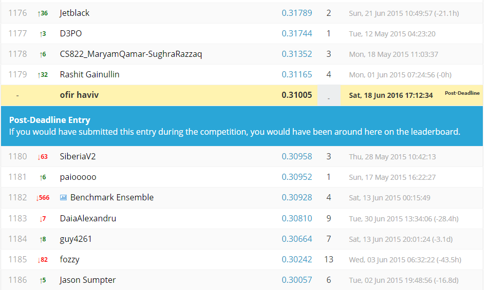

As part of assignment 4, we participated the Kaggle's "Crowdflower Search Results Relevance" competition, see https://www.kaggle.com/c/crowdflower-search-relevance.

To generate a submission to that competition we used the following code:

### The Code:

Clear workspace and set working directory:

```{r}
rm(list = ls(all = TRUE))
setwd("C:/Users/Ofir/Desktop/ex4-master")
```

Install the required packeges:
```{r}
# install.packages("readr")
# install.packages("party")
# #Installation of caret failed for some missing packages, so here we install them:
# install.packages("iterators")
# install.packages("scales")
# install.packages("pbkrtest")
# #for older R versions, an older pbkrtest should be installed:
# install.packages("lme4")
# packageurl <- "https://cran.r-project.org/src/contrib/Archive/pbkrtest/pbkrtest_0.4-4.tar.gz" 
# install.packages(packageurl, repos=NULL, type="source")
# #finally we can install caret:
# install.packages("caret", dependencies = TRUE)
# install.packages(Metrics)
```

Loading the data:

```{r}
library(readr)
unzip("train.csv.zip")
train <- read_csv("train.csv")
unzip("test.csv.zip")
test  <- read_csv("test.csv")
```


####Preprocessing:
We used the following actions to pre-processed the data: 
First we used stemaing so the words with diffrent postfix would be associate in the same way.
```{r eval=FALSE}
#processing
#steaming
library(SnowballC)
library(tm)   
#for the train data
for (j in seq(train$query))
{
  train$query[j]<-stemDocument(train$query[j], language = "english")
}

for (j in seq(train$product_title))
{
  train$product_title[j]<-stemDocument(train$product_title[j], language = "english")
}

for (j in seq(train$product_description))
{
  train$product_description[j]<-stemDocument(train$product_description[j], language = "english")
}
#for the test data
for (j in seq(test$query))
{
  test$query[j]<-stemDocument(test$query[j], language = "english")
}

for (j in seq(test$product_title))
{
  test$product_title[j]<-stemDocument(test$product_title[j], language = "english")
}

for (j in seq(test$product_description))
{
  test$product_description[j]<-stemDocument(test$product_description[j], language = "english")
}
```

The following function gets data and preprocessed the data.
Steps:

1. Remove punctuations.
2. Remove unnecessary letters.
3. Change data to lowercase.
4. Remove stop words.
```{r eval=FALSE}
process_frame <- function (df)
{
#create coprus from the data set
docs <- Corpus(VectorSource(df))

#remove punctuation from the data set
docs <- tm_map(docs, removePunctuation) 

#remove uneceseasry letters
  for(j in seq(docs))   
  {   
    docs[[j]] <- gsub("/", " ", docs[[j]])   
    docs[[j]] <- gsub("@", " ", docs[[j]])   
    docs[[j]] <- gsub("\\|", " ", docs[[j]])  
    docs[[j]] <- gsub("http", " ", docs[[j]])   
    docs[[j]] <- gsub("<.*?>", " ", docs[[j]])   
    docs[[j]] <- gsub("www", " ", docs[[j]])  
    docs[[j]] <- gsub("style", " ", docs[[j]])   
    docs[[j]] <- gsub("px", " ", docs[[j]])   
    docs[[j]] <- gsub("margin", " ", docs[[j]])
  }  


#change data to lowercase
docs <- tm_map(docs, tolower)   

#remove stopwords.
docs <- tm_map(docs, removeWords, stopwords("english")) 

#steaming
docs <- tm_map(docs, stemDocument)   

docs <- tm_map(docs, stripWhitespace)

for (j in seq(docs))
{
  df[j]<-docs[[j]]
}
df
}
```

We preprocessed all the data using the following code:
```{r eval=FALSE}

train$product_description<-process_frame(train$product_description)
train$query<-process_frame(train$query)
train$product_title<-process_frame(train$product_title)

test$product_description<-process_frame(test$product_description)
test$query<-process_frame(test$query)
test$product_title<-process_frame(test$product_title)
```

####Our Smart Features:
In order to characterize good search we created the following features:
1.	Distance string between query and product description.
2.	Word coverage - coverage of words form the query in the product description
3.	Extract main entity - extract main entities form the product description and check if they are exist in the query Distance string function:

Distance string function:
```{r eval=FALSE}
sentencs_dist<- function (s1, s2,qe)
{
  stringdist::stringdist(s1,s2, method = 'qgram', q=qe)
}
```

Method that check the number of words from the query are in the product-description, and return the coverage percent.
```{r eval=FALSE}
contain_words <- function (s1, s2)
{
    sp_e1 <- strsplit(s1, " ")
    sp_e2 <- strsplit(s2, " ")
    sp_e1 <- sp_e1[[1]]
    sp_e2 <- sp_e2[[1]]
    sum<-0
    len <- length(sp_e1)
    val<-0
    if (length(sp_e1)>0 && length(sp_e2)>0)
    {
      for (w in sp_e1)
      {
        if (w %in% sp_e2)
        {
          sum<-sum+1
        }
      }
      val<-sum / len
    }
    val
}
```
Invoke the contain_words function on the test data
```{r eval=FALSE}
#for query and product title
for(j in seq(train$product_title))   
{
  qt <- train$product_title[j]
  q <- train$query[j]
  train$contain_words_title[j]<-contain_words(q,qt)
}
#for query and product description
for(j in seq(train$product_description))   
{
  qt <- train$product_description[j]
  q <- train$query[j]
  train$contain_words_description[j]<-contain_words(q,qt)
}

#############################################test
#for query and product title
for(j in seq(test$product_title))   
{
  qt <- test$product_title[j]
  q <- test$query[j]
  test$contain_words_title[j]<-contain_words(q,qt)
}
#for query and product description
for(j in seq(test$product_description))   
{
  qt <- test$product_description[j]
  q <- test$query[j]
  test$contain_words_description[j]<-contain_words(q,qt)
}
```

Invoke the contain_words function on the test data
```{r eval=FALSE}
min_dis<- function(word, sent,q)
{
  min <- -1
  for (w in sent)
  {
    d <- sentencs_dist(word, w,q)
    if (min!=-1)
    {
      if (min>d)
      {
        min<-d
      }
    }
    if (min==-1)
    {
      min<-d
    }
  }
  min
}
```

Method that calculate for each word in the sent1 it find word from sent2 that together have the minimum string-distance value, and return the average.
```{r eval=FALSE}
min_dis_avg<-function (sent1, sent2,q)
{
  sp_sent1<-strsplit(sent1, " ")
  sp_sent1<-sp_sent1[[1]]
  sp_sent2<-strsplit(sent2, " ")
  sp_sent2<-sp_sent2[[1]]
  len<-length(sp_sent1)
  sum<-0
  for (w in sp_sent1)
  {
    val <- min_dis(w,sp_sent2,q)
    sum <- sum+val
  }
  sum / len
}
```

Invoke the min_dis_avg function on the test and train data
```{r eval=FALSE}
for(j in seq(train$product_title))   
{
  qt <- train$product_title[j]
  q <- train$query[j]
  train$min_dist_Str2[j]<-min_dis_avg(q,qt,2)
}
#for query and product description
for(j in seq(test$product_title))   
{
  qt <- test$product_title[j]
  q <- test$query[j]
  test$min_dist_Str2[j]<-min_dis_avg(q,qt,2)
}
```

Find main entites from the product description and check if they are exist in the query.
```{r eval=FALSE}
###########################################################entity
#install.packages("rJava")
library(rJava)
#install.packages(c("NLP", "openNLP", "RWeka", "qdap"))
#install.packages("openNLPmodels.en",repos = "http://datacube.wu.ac.at/",type = "source")
library(NLP)
library(openNLP)
library(RWeka)

##########################################create annoutator
word_ann <- Maxent_Word_Token_Annotator()
sent_ann <- Maxent_Sent_Token_Annotator()
person_ann <- Maxent_Entity_Annotator(kind = "person")
location_ann <- Maxent_Entity_Annotator(kind = "location")
organization_ann <- Maxent_Entity_Annotator(kind = "organization")
pipeline <- list(sent_ann,
                 word_ann,
                 person_ann,
                 location_ann,
                 organization_ann)

entities <- function(doc, kind) {
  s <- doc$content
  a <- annotations(doc)[[1]]
  if(hasArg(kind)) {
    k <- sapply(a$features, `[[`, "kind")
    s[a[k == kind]]
  } else {
    s[a[a$type == "entity"]]
  }
}

##########################################################################
#this function extract entity of type k from bag_of_entity
#compute the number of entites in bag_of_word
#return normelize value
#################################################### 
common_entites <- function (bag_of_words, bag_of_entity, k)
{
  bio1 <- as.String(bag_of_entity)
  bio_annotations1 <- annotate(bio1, pipeline)
  bio_doc1 <- AnnotatedPlainTextDocument(bio1, bio_annotations1)
  
  e1 <- entities(bio_doc1, kind = k)
  val <- 0
  if (length(e1)>0 && length(bag_of_words)>0)
  {
    sp_e1 <- strsplit(e1, " ")
    sp_bag_of_words <- strsplit(bag_of_words, " ")
    
    len1 <- length(sp_e1[[1]])
    sum <- 0;
    for (p1 in sp_e1[[1]])
    {
      if (p1 %in% sp_bag_of_words[[1]])
      {
        sum<-sum+1
      }
    }
    val <- sum/len1
  }
  val
}
```

In order to avoid tackling test categories that are unfamiliar to the trained model, we make sure that the nominal attribute is set according to categories in both the train and test sets.
```{r eval=FALSE}
library(party)
library(caret)
library(Metrics)

train$median_relevance <- factor(train$median_relevance)

levels(train$contain_words_title) <- union(levels(train$contain_words_title), levels(test$contain_words_title))
levels(train$min_dist_Str) <- union(levels(train$min_dist_Str), levels(test$min_dist_Str))
levels(train$min_dist_Str_desc) <- union(levels(train$min_dist_Str_desc), levels(test$min_dist_Str_desc))
levels(train$min_dist_Str2) <- union(levels(train$min_dist_Str2), levels(test$min_dist_Str2))

levels(test$contain_words_title) <- union(levels(train$contain_words_title), levels(test$contain_words_title))
levels(test$min_dist_Str) <- union(levels(train$min_dist_Str), levels(test$min_dist_Str))
levels(test$min_dist_Str_desc) <- union(levels(train$min_dist_Str_desc), levels(test$min_dist_Str_desc))
levels(test$min_dist_Str2) <- union(levels(train$min_dist_Str2), levels(test$min_dist_Str2))
```

#### Train/test evaluation
Split the training data to training and testing:
```{r eval=FALSE}
inTraining <- sample(1:nrow(train),  .75*nrow(train))
training <- train[ inTraining,]
testing  <- train[-inTraining,]
```


#### Model creation:
```{r eval=FALSE}
model2 <- train(median_relevance ~ contain_words_title+min_dist_Str, data = training,
                method = "rpart",
                trControl = trainControl(classProbs = F))
```

####Classification for evaluation:
```{r eval=FALSE}
results2 <- predict(model2, newdata = testing)
```

#### Evaluation of results:
```{r eval=FALSE}
ScoreQuadraticWeightedKappa(testing$median_relevance, results2, 1, 4)
```


#### Model creation for prediction:
```{r eval=FALSE}
model <- train(median_relevance ~ contain_words_title+min_dist_Str, data = train,
                method = "rpart",
                trControl = trainControl(classProbs = F))
```

#### Classification for prediction:
Classifying the test.csv data and exporting the results to a submission file.
```{r eval=FALSE}
results <- predict(model, newdata = test)
Newsubmission = data.frame(id=test$id, prediction = results)
write.csv(Newsubmission,"model.csv",row.names=F)  
```


###The Result:

We submitted the output csv file of our program to the competition.
We got the following ranking:



The submitted csv file called "model.csv".
The file is available within the following link: [model.csv](https://github.com/ofirhav/ex4/blob/master/model.csv) 

###Conclusions
1. String distance is the most effective analysis we found that point on good search result.
2. As expected the percent of the word from the query that exist in the product description indicate on good search result.
3. Surprisingly the analysis for main entities didn't indicate on good search and even decrease the results. Our assumption that for every search the main entity words exist in the product description and that why it can indicate on good search result.